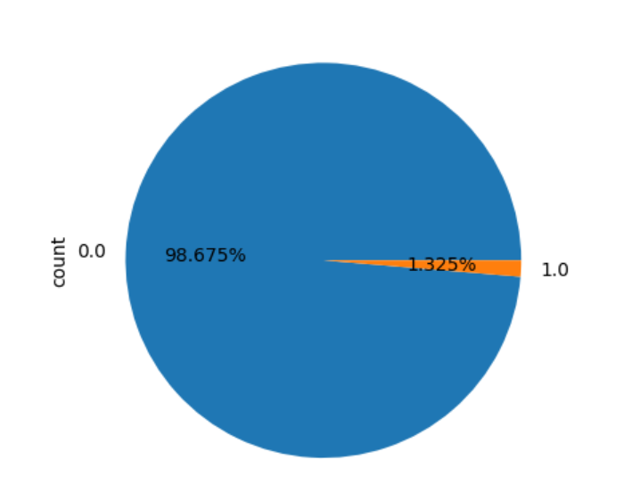
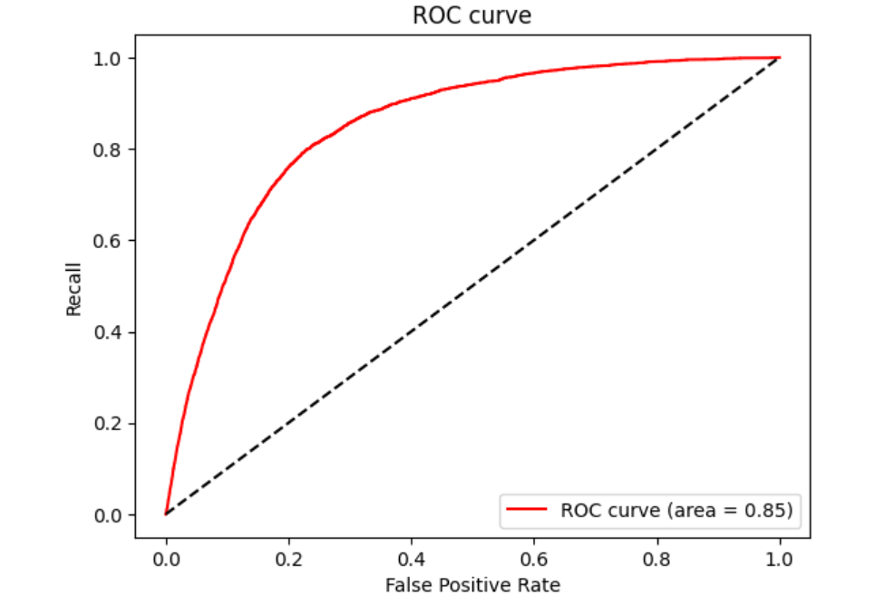

## 1.LogisticRegression模型

### （1）Packages and Libraries

- Import the Required Packages

```
import pandas as pd
import numpy as np
import matplotlib.pyplot as plt

from sklearn.linear_model import LogisticRegression as LR
from sklearn.model_selection import train_test_split
from sklearn.metrics import confusion_matrix, classification_report
from sklearn.metrics import roc_auc_score, roc_curve, auc
from sklearn.preprocessing import MinMaxScaler
from imblearn.over_sampling import SMOTE
```

### （2）Data Preparation and Analysis

- Import the Raw Dataset

```
df = pd.read_csv(r'D:\develop\train.csv')
```

- Plot a Pie Chart to Show the Classification of 5G Users

```
df.describe()
df['target'].value_counts()
df['target'].value_counts().plot(kind='pie',autopct='%.3f%%')
```



### （3）Split the Dataset and Train the Model

- Extract the Feature Matrix and Labels

```
x = df.iloc[:, 1:-1]
y = df.iloc[:, -1]
```

-  Split the Training and Test Sets and Shuffle the Data

```
Xtrain, Xtest, Ytrain, Ytest = train_test_split(x, y, test_size=0.3, random_state=12)
```

-  Reset the Index of the Training and Test Sets

```
for i in [Xtrain, Xtest, Ytrain, Ytest]:
    i.reset_index(drop=True, inplace=True)
```

-  Normalize All Features

```
mms = MinMaxScaler()
Xtrain = pd.DataFrame(mms.fit_transform(Xtrain), columns=Xtrain.columns)
Xtest = pd.DataFrame(mms.transform(Xtest), columns=Xtest.columns)
```

- Oversampling the Training Set

```
model_smote = SMOTE()
Xtrain, Ytrain = model_smote.fit_resample(Xtrain, Ytrain)
```

- Train a Logistic Regression Model with 'saga' Solver and Increased Maximum Iterations

```
clf = LR(max_iter=20000, C=9.4, solver='saga')
clf = clf.fit(Xtrain, Ytrain)

print('训练集上的预测准确率为：', clf.score(Xtrain, Ytrain))
print('测试集上的预测准确率为：', clf.score(Xtest, Ytest))
```

### （4）Performance Evaluation

- Output the Confusion Matrix

```
print('混淆矩阵：\n', confusion_matrix(Ytest, clf.predict(Xtest)))
```

- Check the AUC score on the test set

```
area = roc_auc_score(Ytest, clf.predict_proba(Xtest)[:, 1])
print('AUC面积为：', area)

print(classification_report(Ytest, clf.predict(Xtest)))
```

- Plot the ROC curve

```
FPR, recall, thresholds = roc_curve(Ytest, clf.predict_proba(Xtest)[:, 1])
plt.figure()
plt.plot(FPR, recall, color='red', label='ROC curve (area = %0.2f)' % area)
plt.plot([0, 1], [0, 1], color='black', linestyle='--')
plt.xlim([-0.05, 1.05])
plt.ylim([-0.05, 1.05])
plt.xlabel('False Positive Rate')
plt.ylabel('Recall')
plt.title('ROC curve')
plt.legend(loc='lower right')
plt.show()
```



## 2.xgboost模型

#### (1)Packages and Libraries
* The most core algorithm libraries
```
from xgboost import XGBClassifier
```
* Import other necessary libraries
```
from IPython.display import display
import pandas as pd
import matplotlib.pyplot as plt
from sklearn.model_selection import train_test_split, KFold
from sklearn.metrics import roc_auc_score, roc_curve
```
#### (2)Prepare and analyze the data
* Read data from the file, view basic information about the data, and print descriptive statistics for each feature in the dataset
```
train_df = pd.read_csv(r'D:\develop\train.csv')
display(train_df.head())
train_df.info()
print(train_df.describe())
```
* Plot a bar chart to show the classification of 5G users
```
print(train_df['target'].value_counts())
train_df['target'].value_counts().plot(kind='bar')
plt.show()
```

* Data preprocessing, extract feature matrix X and labels y
```
x = train_df.iloc[:, 1:-1]  
y = train_df.iloc[:, -1]    
```
#### (3)Split the dataset and train the model
* Use the `train_test_split` function to split the dataset into training and testing sets
```
Xtrain, Xtest, Ytrain, Ytest = train_test_split(x, y, test_size=0.2, random_state=seed)
```
* Define XGBoost model parameters
```
xgb_params = {
    'booster': 'gbtree', 
    'objective': 'binary:logistic',
    'n_estimators': 200,  
    'max_depth': 8, 
    'lambda': 10,  
    'subsample': 0.7, 
    'colsample_bytree': 0.8,  
    'colsample_bylevel': 0.7,  
    'eta': 0.1,  
    'tree_method': 'hist', 
    'seed': seed, 
    'nthread': 16 
}
```
* Train the XGBoost model
```
xgb_model = XGBClassifier(**xgb_params, eval_metric='auc', early_stopping_rounds=20)
xgb_model.fit(Xtrain, Ytrain, eval_set=[(Xtrain,Ytrain),(Xval, Yval)], verbose=True)
```
#### (4)Performance evaluation
* Calculate and print the AUC score on the test set
```
test_auc = roc_auc_score(Ytest, Ypred)
print(f"Test AUC: {test_auc}")
```
* Plot the ROC curve
```
fpr, tpr, thresholds = roc_curve(Ytest, Ypred)
plt.figure(figsize=(8, 6))
plt.plot(fpr, tpr, label=f'ROC curve (area = {test_auc:0.2f})')
plt.plot([0, 1], [0, 1], 'k--')
plt.xlim([0.0, 1.0])
plt.ylim([0.0, 1.05])
plt.xlabel('False Positive Rate')
plt.ylabel('True Positive Rate')
plt.title('Receiver Operating Characteristic - Test Set')
plt.legend(loc="lower right")
plt.show()
```


