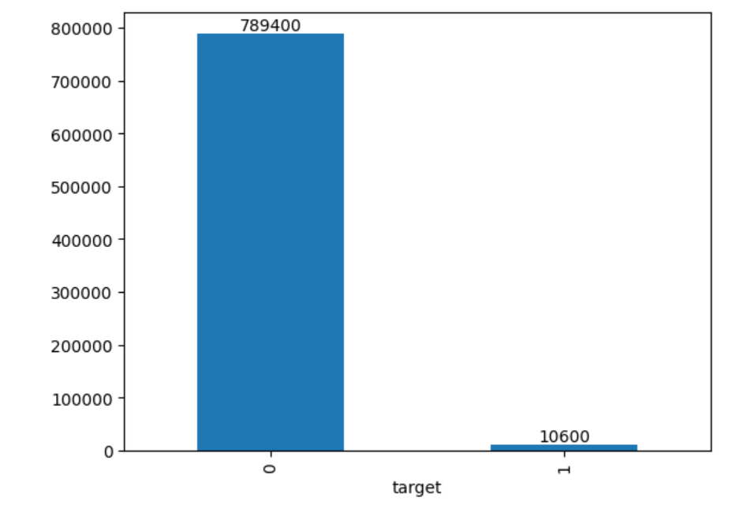

## 2.xgboost模型
#### (1)包和库
* 最核心的算法库
```
from xgboost import XGBClassifier
```
* 导入其他必要的库
```
from IPython.display import display
import pandas as pd
import matplotlib.pyplot as plt
from sklearn.model_selection import train_test_split, KFold
from sklearn.metrics import roc_auc_score, roc_curve
```
#### (2)数据准备并分析数据
* 从文件中读取数据，查看数据的基本信息，打印数据集中每个特征的描述性统计
```
train_df = pd.read_csv(r'D:\develop\train.csv')
display(train_df.head())
train_df.info()
print(train_df.describe())
```
* 绘制条形图显示5G用户分类的情况
```
print(train_df['target'].value_counts())
train_df['target'].value_counts().plot(kind='bar')
plt.show()
```

* 数据预处理，提取特征矩阵x和标签y
```
x = train_df.iloc[:, 1:-1]  
y = train_df.iloc[:, -1]    
```
#### (3)拆分数据集并训练模型
* 使用train_test_split函数切分数据集为训练集和测试集
```
Xtrain, Xtest, Ytrain, Ytest = train_test_split(x, y, test_size=0.2, random_state=seed)
```
* 定义xgboost模型参数
```
xgb_params = {
    'booster': 'gbtree', 
    'objective': 'binary:logistic',
    'n_estimators': 200,  
    'max_depth': 8, 
    'lambda': 10,  
    'subsample': 0.7, 
    'colsample_bytree': 0.8,  
    'colsample_bylevel': 0.7,  
    'eta': 0.1,  
    'tree_method': 'hist', 
    'seed': seed, 
    'nthread': 16 
}
```
* 训练xgboost模型
```
xgb_model = XGBClassifier(**xgb_params, eval_metric='auc', early_stopping_rounds=20)
xgb_model.fit(Xtrain, Ytrain, eval_set=[(Xtrain,Ytrain),(Xval, Yval)], verbose=True)
```
#### (4)性能评估
* 计算并打印测试集上的AUC分数
```
test_auc = roc_auc_score(Ytest, Ypred)
print(f"Test AUC: {test_auc}")
```
* 绘制ROC曲线
```
fpr, tpr, thresholds = roc_curve(Ytest, Ypred)
plt.figure(figsize=(8, 6))
plt.plot(fpr, tpr, label=f'ROC curve (area = {test_auc:0.2f})')
plt.plot([0, 1], [0, 1], 'k--')
plt.xlim([0.0, 1.0])
plt.ylim([0.0, 1.05])
plt.xlabel('False Positive Rate')
plt.ylabel('True Positive Rate')
plt.title('Receiver Operating Characteristic - Test Set')
plt.legend(loc="lower right")
plt.show()
```


